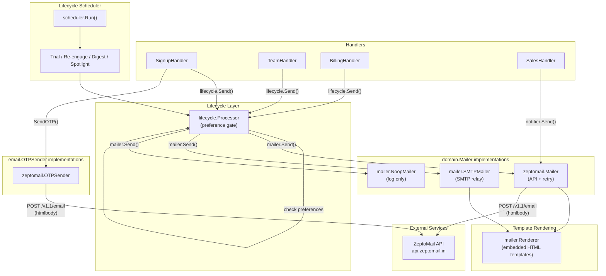

# Email System Architecture

This document describes the email delivery architecture for FeatureSignals. It covers provider selection, template rendering, the lifecycle preference gate, and retry behavior.

## Provider Strategy

The email system uses a **Strategy pattern** with two independent interfaces:

- `email.OTPSender` -- sends OTP verification codes during signup
- `domain.Mailer` -- sends lifecycle/transactional emails (welcome, billing, team invites, etc.)

Both are selected at startup via the `EMAIL_PROVIDER` environment variable.

| `EMAIL_PROVIDER` | OTP Sender | Lifecycle Mailer | Use Case |
|---|---|---|---|
| `zeptomail` (default) | `zeptomail.OTPSender` | `zeptomail.Mailer` | Production (cloud) |
| `smtp` | `email.SMTPSender` | `mailer.SMTPMailer` | On-prem / self-hosted |
| `none` | nil | `mailer.NoopMailer` | Development |

## Per-Purpose Sender Addresses

Emails are sent from different addresses depending on their category. The `domain.SenderIdentity` map defines defaults per template. The `lifecycle.Processor` applies these automatically before passing the message to the mailer -- handlers don't need to set `FromEmail` explicitly unless overriding.

| Category | FromEmail | ReplyTo |
|---|---|---|
| Billing (payment, cancellation, renewal, downgrade) | `billing@featuresignals.com` | `support@featuresignals.com` |
| Sales (enterprise inquiry ack) | `sales@featuresignals.com` | `sales@featuresignals.com` |
| Security (alerts) | `security@featuresignals.com` | `security@featuresignals.com` |
| Account (deletion) | `noreply@featuresignals.com` | `support@featuresignals.com` |
| Everything else (welcome, team, digest, OTP, etc.) | `noreply@featuresignals.com` (default) | -- |

Handlers can override `FromEmail`, `FromName`, and `ReplyTo` on any `EmailMessage` if needed.

## Data Flow



## Template System

Templates are embedded Go HTML files in `server/internal/mailer/templates/`. They are parsed once at startup by `mailer.NewRenderer()` and shared across all mailer implementations.

Each template receives a `map[string]string` with merge variables. `Subject` and `ToName` are automatically injected.

### Template Inventory

| Template ID | Priority | Triggered By |
|---|---|---|
| `welcome` | Transactional | SignupHandler (on verify) |
| `team_invite` | Transactional | TeamHandler (on invite) |
| `payment_success` | Transactional | BillingHandler (on payment) |
| `payment_failed` | Transactional | BillingHandler (on failure) |
| `payment_failed_final` | Transactional | BillingHandler (final notice) |
| `cancellation_confirmed` | Transactional | BillingHandler |
| `deletion_requested` | Transactional | Future handler |
| `deletion_canceled` | Transactional | Future handler |
| `enterprise_inquiry_ack` | Transactional | SalesHandler |
| `security_alert` | Transactional | Future handler |
| `export_ready` | Transactional | Future handler |
| `trial_midpoint` | Important | Scheduler (7 days before expiry) |
| `trial_ending` | Important | Scheduler (2 days before expiry) |
| `trial_expired` | Important | Scheduler (after expiry) |
| `renewal_upcoming` | Important | Scheduler (3 days before renewal) |
| `downgrade_effective` | Important | Future handler |
| `api_key_created` | Important | Future handler |
| `activation_first_flag` | Lifecycle | Future handler |
| `activation_first_eval` | Lifecycle | Future handler |
| `team_joined` | Lifecycle | Future handler |
| `weekly_digest` | Lifecycle | Scheduler (Mondays) |
| `re_engage_48h` | Lifecycle | Scheduler (inactive users) |
| `re_engage_14d` | Lifecycle | Scheduler (inactive users) |
| `re_engage_90d` | Lifecycle | Scheduler (inactive users) |
| `upgrade_limit_hit` | Lifecycle | Future handler |
| `feature_announcement` | Lifecycle | Future handler |
| `feature_spotlight_segments` | Lifecycle | Scheduler |
| `feature_spotlight_webhooks` | Lifecycle | Scheduler |
| `feature_spotlight_team` | Lifecycle | Scheduler |

## Preference Gate

The `lifecycle.Processor` checks user email preferences before delivery:

- **Transactional** (OTP, receipts, security) -- always sent regardless of preferences
- **Important** (trial, payment, team) -- sent unless user chose "transactional only"
- **Lifecycle** (digest, tips, announcements) -- sent only when preference is "all"

## Retry Behavior (ZeptoMail)

The `zeptomail.Mailer` and `zeptomail.OTPSender` implement retry with exponential backoff:

- Max attempts: 3
- Base backoff: 200ms, multiplied by 4x per attempt
- Random jitter added to prevent thundering herd
- 4xx errors: no retry (client error, fix needed)
- 5xx errors: retry (server-side transient failure)
- Network errors: retry

## Observability

- Success: `EventEmailSent` product event emitted by `lifecycle.Processor`
- Failure: `EventEmailFailed` product event emitted by `lifecycle.Processor`
- All email operations are logged with structured fields: `template`, `to`, `request_id`, `duration_ms`, `status_code`, `attempt`
- ZeptoMail operations include OpenTelemetry tracing spans

## Adding a New Email

1. Add `TemplateID` constant to `domain/mailer.go`
2. Add priority mapping to `domain.TemplateMeta`
3. Create HTML template file in `mailer/templates/<id>.html`
4. Call `lifecycle.Send()` from the appropriate handler with a detached context:

```go
go func() {
    sendCtx, sendCancel := context.WithTimeout(context.Background(), 10*time.Second)
    defer sendCancel()
    _ = h.lifecycle.Send(sendCtx, userID, domain.EmailMessage{
        To:       user.Email,
        ToName:   user.Name,
        Template: domain.TemplateNewTemplate,
        Subject:  "Subject line",
        Data:     map[string]string{"Key": "value"},
    })
}()
```
